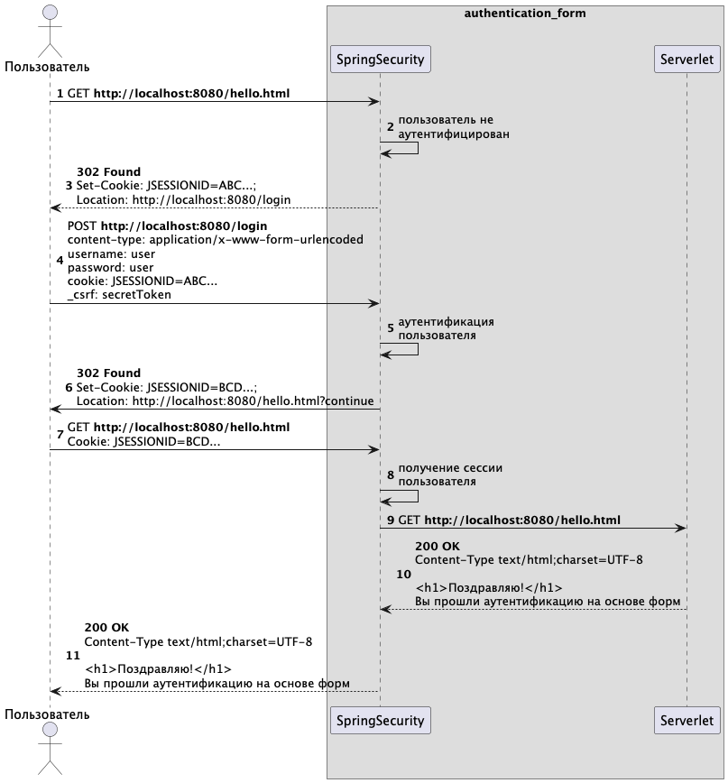

# 🔐 Form Login Authentication – Spring Security

Микросервис реализует схему аутентификации на основе формы входа (Form Login) с использованием Spring Security.

Разработка выполнена в рамках выпускной квалификационной работы:

> **Анализ современных методов аутентификации: устойчивость к угрозам информационной безопасности и перспективы развития беспарольных технологий**  
> НИУ ВШЭ, направление "Информационная безопасность", Федосов М.И., 2025

---

## 📌 Описание

HForm Login — классическая схема аутентификации в веб-приложениях через HTML-форму. Используется в случае, если приложение предполагает взаимодействие с пользователем через браузер. Spring Security предоставляет готовые средства для настройки и защиты таких форм.



Микросервис:

- Разработан с использованием Spring Boot 3 и Spring Security.
- Включает форму входа `/login`.
- Предоставляет защищённую конечную точку `/hello` для аутентифицированных пользователей.
- Включает демонстрационные уязвимые контроллеры для XSS и CSRF атак:
    - `/xss-demo/product-search` — демонстрация XSS уязвимости.
    - `/csrf-demo/account-info` и `/csrf-demo/update-password` — демонстрация CSRF через XSS.

---

## 🧩 Технологии

- Java 21
- Spring Boot 3
- Spring Security
- Maven

---

## ⚙️ Запуск проекта

```bash
git clone https://github.com/m-fedosov/authentication_form.git
cd authentication_form
./mvnw spring-boot:run
```

